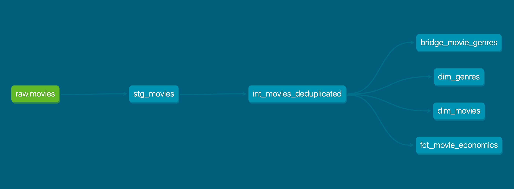

# Splice Data Warehouse
### dbt + DuckDB

This project transforms a messy movie dataset into a clean, searchable warehouse. I moved away from using one giant flat file and instead built a Star Schema to keep the data organized and reliable.

## Data Flow
Everything moves from raw files into staging, through a cleanup layer, and finally into the "marts" where the data is ready for analysis.

## The Setup

### Dimensional Modeling
I split the data into **Facts** (the numbers, like revenue and budget) and **Dimensions** (the descriptions, like movie titles and release dates). This keeps the warehouse efficient and easy to query.

### The Bridge Table
Movies often have multiple genres (e.g., Sci-Fi and Action). I built a bridge table to handle this many-to-many relationship. This allows us to filter by genre without accidentally duplicating the revenue numbers in our reports.

### Tracking History with Snapshots
Some values in this dataset — like box office totals — can get revised after the fact. To avoid silently overwriting the old number, I used a dbt **snapshot** to track changes over time instead of just storing the current value.

Each time the snapshot runs, it checks the tracked columns for changes. If a value changed, the old row is closed out (`dbt_valid_to` gets set) and a new row is inserted (`dbt_valid_from` reset, `dbt_valid_to` null). This is the standard **Slowly Changing Dimension (Type 2)** pattern — it means I can always answer "what did we know at the time" instead of only "what do we know now."

### Data Quality
I used dbt tests to make sure the data stays clean:
* **Uniqueness**: Making sure we don't have duplicate movies.
* **Relationships**: Ensuring every "Fact" correctly points to a real "Dimension."
* **Null checks**: Checking for missing data in critical columns.

## Tech Stack
* **DuckDB**: The database engine.
* **dbt**: The transformation and testing logic.
* **Python**: Used for the initial data ingestion.

## How to Run
1. `source .venv/bin/activate`
2. `python scripts/ingest.py`
3. `dbt build`
4. `dbt snapshot`